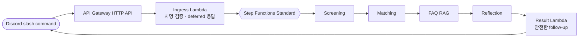

# Agent Architecture Lab

Discord에서 커뮤니티 운영 업무를 실습하는 작은 에이전트입니다.

이 레포는 OpenAI API와 AWS 서버리스만 사용합니다. 모든 입력은 합성 또는 익명화된 데이터만 허용하며, 최종 판단은 코드가 합니다.

## 한눈에 보기



`dev` 스택만 운영합니다. 데이터베이스, 벡터 데이터베이스, 컨테이너, 실데이터는 범위에 없습니다.

## 무엇을 배우나

| 모듈 | 핵심 원칙 |
| --- | --- |
| Screening | 모델은 라벨만 만들고, 선발 기준은 코드가 적용합니다. |
| Matching | 점수와 정렬 기준을 결정적으로 계산합니다. |
| FAQ RAG | 답변에는 검색된 출처가 반드시 있어야 합니다. |
| Reflection | 초안 수정은 최대 한 번만 허용합니다. |
| Workflow | 단계 실패 뒤의 실행을 멈추고 측정값을 JSONL로 남깁니다. |

## 빠른 시작

```bash
uv sync --all-groups
uv run pytest -q
sam validate --lint --template-file infra/template.yaml
sam build --template-file infra/template.yaml
```

벤치마크는 합성 케이스로만 실행합니다.

```bash
uv run python evaluations/run_benchmark.py \
  --output /tmp/community-ops-benchmark.jsonl
```

## Dev 배포

AWS, Secrets Manager, Discord 설정은 account owner가 수행합니다.

- [Dev 배포 runbook](docs/deploy-dev.md)
- [Benchmark 기록 형식](docs/benchmark.md)

배포 전 확인할 것:

- OpenAI API key는 Secrets Manager에만 저장합니다.
- Discord 초기 응답은 3초 안에 deferred response로 반환합니다.
- 결과 메시지는 `allowed_mentions: {"parse": []}`로 전송합니다.
- CloudWatch 로그는 7일만 보존합니다.

## 작업 방식

실험은 `tests/`에서 고정 샘플로 검증한 뒤 `src/`로 옮깁니다. PR은 테스트와 SAM 검증을 통과해야 하며, `main`은 검토된 dev 배포 기준입니다.
