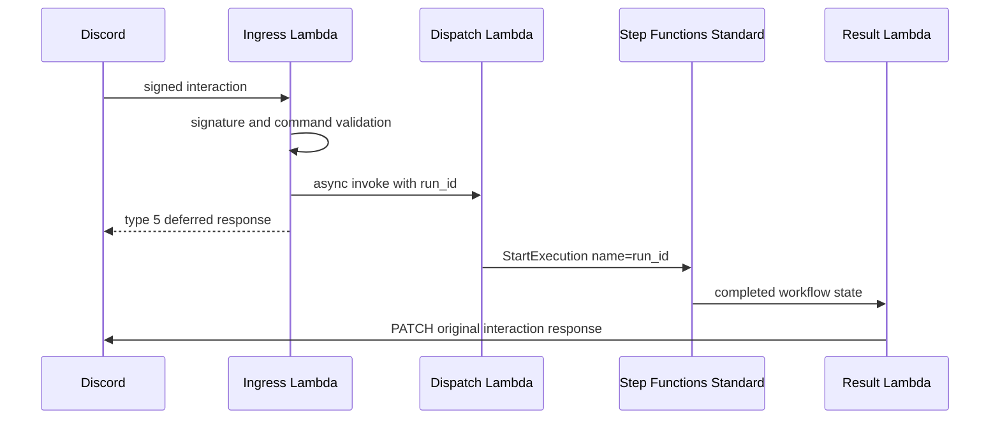
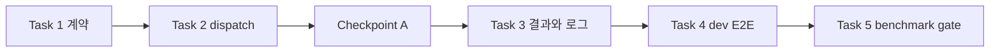

# aal-agent Discord 비동기 실행 신뢰성 설계안

## 상태

제안됨. 구현과 dev 배포 전 검토가 필요하다.

## Executive Summary

| 항목 | 결정 | 성공 기준 |
| --- | --- | --- |
| 초기 응답 | ingress가 workflow 완료를 기다리지 않고 Discord deferred 응답을 반환 | Discord가 3초 안에 초기 응답을 수신 |
| 실행 시작 | 별도 dispatch Lambda가 Standard Step Functions를 실행 | 동일 interaction ID는 하나의 execution으로 수렴 |
| 최종 응답 | 원본 deferred 응답을 PATCH | 재시도되어도 Discord 메시지가 중복 생성되지 않음 |
| 관측 | `run_id` 중심 구조화 로그와 CloudWatch 경보 | 실패 위치와 Discord 오류 code를 한 조회에서 판별 |
| 안전 | 허용된 slash command와 synthetic 입력만 실행 | 비허용 command, raw token, request body가 로그나 workflow에 남지 않음 |
| 품질 승격 | 프롬프트, 모델, RAG, Reflection 변경은 locked benchmark의 비회귀 증거 뒤에만 기본값 변경 | 성공률과 citation 조건은 하락하지 않고 비용 또는 latency 개선이 확인됨 |

현재 `DiscordIngressFunction`은 `start_execution`이 끝난 뒤 type 5 deferred 응답을 반환한다. Discord의 초기 응답 제한은 3초이므로 Lambda timeout을 10초로 늘려도 cold start, AWS SDK 초기화, StartExecution 지연 또는 권한 오류가 있으면 사용자는 timeout을 본다. 이 계획은 ingress의 동기 구간을 서명 검증, 최소 입력 검증, 비동기 dispatch 수락, type 5 응답으로만 제한한다.

## 목표와 비목표

### 목표

- `aal-test`가 Discord의 초기 응답 제한 안에 deferred 응답을 받게 한다.
- workflow 시작과 결과 전달의 중복을 interaction ID 단위로 통제한다.
- 운영자가 `run_id` 하나로 ingress, dispatch, Step Functions, 결과 전달 실패를 추적하게 한다.
- 기존 synthetic 입력, Standard Step Functions, Lambda, API Gateway만 사용한다.

### 비목표

- persistent database, queue, container, prod stack을 새로 추가하지 않는다.
- 실제 사용자 데이터나 개인 정보를 처리하지 않는다.
- screening, matching, FAQ, reflection의 도메인 결정 규칙을 바꾸지 않는다.
- Discord command를 범용 agent shell로 확장하지 않는다.

## 설계



### 1. Ingress는 빠른 접수 경계다

`src/handlers/discord_ingress.py`는 다음만 수행한다.

1. Discord 서명과 interaction type을 검증한다.
2. 등록 command allowlist에 없는 요청을 거부한다. 첫 범위의 allowlist는 `aal-test` 하나다.
3. `run_id`, command, options, interaction token만 담은 최소 dispatch payload를 만든다.
4. `DiscordDispatchFunction`을 `InvocationType=Event`로 호출한 뒤 Discord type 5 응답을 반환한다.

Ingress는 domain module, OpenAI, Step Functions 동기 완료, Discord 결과 PATCH를 기다리지 않는다. async invoke 수락 실패는 구조화 로그로 남기고 HTTP 500을 반환한다. 이 실패는 retry 가능한 운영 실패이며, 요청 body나 interaction token은 기록하지 않는다.

### 2. Dispatch가 idempotent workflow 시작을 소유한다

새 `DiscordDispatchFunction`은 async payload를 받아 기존 `_workflow_input` 변환과 `StartExecution`을 수행한다. Standard Step Functions execution 이름은 Discord interaction ID와 같은 `run_id`로 고정한다.

- 같은 interaction의 delivery 재시도는 같은 execution 이름을 사용한다.
- 이미 시작된 execution에 해당하는 AWS 응답은 dispatch 성공으로 기록하고 새 execution을 만들지 않는다.
- 다른 입력으로 같은 `run_id`가 들어오면 실패로 기록하고 운영자 조사가 필요하다.
- dispatch payload에는 synthetic `aal-test` fixture 외의 사용자 원문을 추가하지 않는다.

이 결정은 별도 persistent database를 추가하지 않고도 workflow 시작의 중복을 통제한다. AWS StartExecution의 Standard workflow idempotency 동작은 구현 전에 공식 API 문서로 다시 확인하고, 검증 테스트는 실제 dev stack에서 수행한다.

### 3. Result는 원본 응답만 수정한다

`src/handlers/discord_result.py`는 새 follow-up 메시지를 만들지 않고 현재처럼 `/messages/@original`만 PATCH한다. 같은 완료 상태를 여러 번 PATCH해도 메시지가 추가되지 않는 성질을 활용한다.

Result 입력에는 `run_id`, `workflow_status`, Discord interaction token만 필요하다. 성공과 실패 문구는 안전한 고정 문구만 사용한다. Discord 오류 code, HTTP status, `run_id`는 로그에 남기되 token, request body, 모델 입력과 모델 출력 원문은 남기지 않는다.

### 4. 관측과 시간 예산

모든 Lambda가 아래 JSON 필드를 같은 이름으로 기록한다.

```text
event, run_id, command, component, outcome, latency_ms, aws_request_id,
execution_arn, discord_http_status, discord_error_code
```

`outcome`은 `accepted`, `rejected`, `dispatch_failed`, `execution_started`, `execution_already_exists`, `workflow_failed`, `result_sent`, `result_failed`만 허용한다. `command`는 allowlist 값만 기록한다.

초기 응답 SLO는 ingress 2초 이내, Discord 외부 제한은 3초다. workflow 전체 목표는 interaction token 유효 기간인 15분보다 충분히 짧게 두며, 기존 각 stage의 10초 timeout과 result HTTP 5초 timeout을 합친 실제 상한을 dev 실행으로 측정한다.

CloudWatch 경보는 ingress 오류, dispatch 오류, Step Functions failed 또는 timed out, result 전달 오류를 각각 분리한다. 0건 실행도 배포 뒤 확인 대상이다.

### 5. 테스트 경계

단위 테스트는 handler 의존성을 주입해 아래를 검증한다.

- ingress는 dispatch가 수락되면 type 5를 반환한다.
- ingress는 비허용 command로 dispatch하지 않는다.
- dispatch는 `run_id`를 execution 이름으로 사용한다.
- 이미 존재하는 execution은 성공으로 수렴하고, 다른 입력 충돌은 실패한다.
- result 재시도는 같은 `@original` URL만 PATCH한다.
- 로그 필터는 token과 raw body를 내보내지 않는다.

dev E2E는 `aal-test` 한 번으로 initial deferred 응답, Standard execution, 최종 메시지 수정, 구조화 로그의 동일 `run_id`를 모두 확인한다. 같은 payload를 다시 전달해 execution 중복이 없는지도 확인한다.

### 6. 프롬프트와 비용 변경은 benchmark gate를 통과해야 한다

FAQ prompt, model, retrieval chunk 수, context 축약, Reflection 정책을 기본값으로 바꾸는 PR은 locked synthetic benchmark를 baseline과 candidate로 각각 실행한다. candidate는 아래 조건을 모두 만족할 때만 기본값으로 승격한다.

- 모든 locked case가 실행을 완료하고 errored run이 없다.
- 성공률과 FAQ citation 포함률이 baseline보다 낮지 않다.
- `input_tokens`, `output_tokens`, `estimated_cost_usd`, `latency_ms` 중 사전에 선언한 개선 지표가 개선된다.
- 성공률, citation, 비용, latency의 비교 결과와 실행 commit SHA를 Git 밖의 JSONL evidence에 남긴다.
- 기본값 변경은 사람이 benchmark evidence를 검토한 뒤 승인한다.

이 gate는 모델 품질을 토큰 절감과 바꾸지 않게 한다. benchmark는 외부 API 결과를 포함하므로 재현을 위해 case ID, 모델 ID, 설정 digest, code commit SHA만 Git에 기록하고 원문 입력, interaction token, secret은 기록하지 않는다.

## 작업 계획

### Task 1: interaction과 dispatch 계약 고정

**범위:** S

**예상 파일:** `src/handlers/discord_ingress.py`, `src/handlers/discord_dispatch.py`, `tests/test_discord_ingress.py`, `tests/test_discord_dispatch.py`

**완료 조건:**

- [ ] `DispatchRequest`가 최소 필드와 Pydantic 또는 명시적 typed contract로 정의된다.
- [ ] `aal-test`만 허용되고 다른 command는 workflow 시작 없이 거부된다.
- [ ] async Lambda invoke 호출과 type 5 응답 순서가 테스트로 고정된다.

**검증:** `uv run pytest tests/test_discord_ingress.py tests/test_discord_dispatch.py -q`

**의존성:** 없음

### Task 2: idempotent dispatch와 SAM 연결

**범위:** M

**예상 파일:** `src/handlers/discord_dispatch.py`, `infra/template.yaml`, `tests/test_discord_dispatch.py`

**완료 조건:**

- [ ] dispatch Lambda가 `run_id`를 Standard execution 이름으로 사용한다.
- [ ] ingress role에는 dispatch Lambda async invoke 권한만, dispatch role에는 StartExecution 권한만 부여된다.
- [ ] duplicate와 input conflict 처리가 테스트된다.

**검증:** `uv run pytest tests/test_discord_dispatch.py -q && sam validate --template-file infra/template.yaml`

**의존성:** Task 1

### Checkpoint A: dev 배포 전 코드 검토

- [ ] focused tests와 전체 `uv run pytest -q`가 통과한다.
- [ ] `sam validate --template-file infra/template.yaml`가 통과한다.
- [ ] template IAM diff에 새 Lambda invoke와 StartExecution 외의 설명되지 않은 권한 변경이 없다.
- [ ] 실행 input과 로그에 raw token, body, secret이 없음을 코드 검토로 확인한다.

### Task 3: 결과 전달 idempotency와 구조화 로그

**범위:** S

**예상 파일:** `src/handlers/discord_result.py`, `src/handlers/discord_ingress.py`, `src/handlers/discord_dispatch.py`, 관련 tests

**완료 조건:**

- [ ] 모든 component가 동일한 `run_id`와 allowlisted outcome을 기록한다.
- [ ] result는 원본 응답 PATCH만 사용한다.
- [ ] Discord 오류 code가 기록되며 token과 raw body는 기록되지 않는다.

**검증:** `uv run pytest tests/test_discord_result.py tests/test_discord_ingress.py tests/test_discord_dispatch.py -q`

**의존성:** Task 2

### Task 4: dev E2E와 관측 runbook 갱신

**범위:** S

**예상 파일:** `docs/deploy-dev.md`, `docs/benchmark.md`, 필요 시 `infra/template.yaml`

**완료 조건:**

- [ ] dev deployment runbook에 `run_id` 기반 조회 순서가 있다.
- [ ] `aal-test` 초기 응답, execution 성공, 최종 Discord 메시지, duplicate 재전송을 기록한다.
- [ ] 실행 수가 0인 경우와 각 실패 경보의 확인 절차가 있다.

**검증:** account owner가 clean dev stack에서 E2E를 실행하고 CloudWatch 및 Step Functions 증거를 남긴다.

**의존성:** Checkpoint A, Task 3

### Task 5: benchmark 승격 gate 구현

**범위:** M

**예상 파일:** `evaluations/run_benchmark.py`, `evaluations/cases.json`, `docs/benchmark.md`, benchmark tests

**완료 조건:**

- [ ] baseline과 candidate의 success, citation, token, cost, latency를 동일 case ID로 비교한다.
- [ ] errored run, success 회귀, citation 회귀는 candidate 승격을 실패로 판정한다.
- [ ] evidence에는 code commit SHA, model ID, 설정 digest, aggregate 지표만 남고 원문과 secret은 남지 않는다.

**검증:** synthetic fixture로 success 회귀, citation 회귀, 비용 개선, errored run을 각각 재현하는 focused tests가 통과한다.

**의존성:** Task 4

## 실행 순서와 책임



- 구현자는 Task 1부터 Task 3까지 feature branch에서 수행한다.
- account owner는 Checkpoint A 뒤 IAM 포함 dev deployment와 Discord endpoint 변경을 수행한다.
- Task 5의 기본값 변경은 benchmark evidence를 검토한 사람이 승인한 뒤에만 반영한다.
- prod 배포와 real data 사용은 이 계획 범위 밖이다.

## 위험과 완화

| 위험 | 영향 | 완화 |
| --- | --- | --- |
| Discord 초기 3초 제한 | 사용자가 timeout을 봄 | ingress 경로를 최소화하고 dev에서 p95 latency를 측정 |
| async invoke 전달 실패 | 접수 후 workflow가 시작되지 않음 | dispatch 수락 실패를 500과 구조화 로그로 남기고 실패 경보 설정 |
| duplicate delivery | 같은 workflow가 여러 번 실행됨 | `run_id` 기반 Standard execution 이름과 duplicate 테스트 |
| Discord token 만료 | 최종 메시지가 보이지 않음 | workflow 및 result latency 측정, timeout과 실패 code 경보 |
| 로그 민감 정보 노출 | token 또는 입력 노출 | allowlisted 필드만 구조화 로그에 기록하고 unit test로 확인 |

## 구현 전 확인할 항목

1. account owner가 현재 Discord interaction endpoint가 `community-ops-dev`의 최신 `DiscordInteractionEndpoint`와 일치하는지 확인한다.
2. account owner가 AWS 세션을 갱신한 뒤 ingress 로그에서 현재 timeout 요청의 `run_id` 또는 signature failure 여부를 확인한다.
3. Task 2 구현 전 AWS Standard StartExecution idempotency 세부 조건을 공식 API 문서로 확인한다.

## 참조

- [Discord interaction response rules](https://docs.discord.com/developers/interactions/receiving-and-responding)
- [AWS Step Functions StartExecution API](https://docs.aws.amazon.com/step-functions/latest/apireference/API_StartExecution.html)
